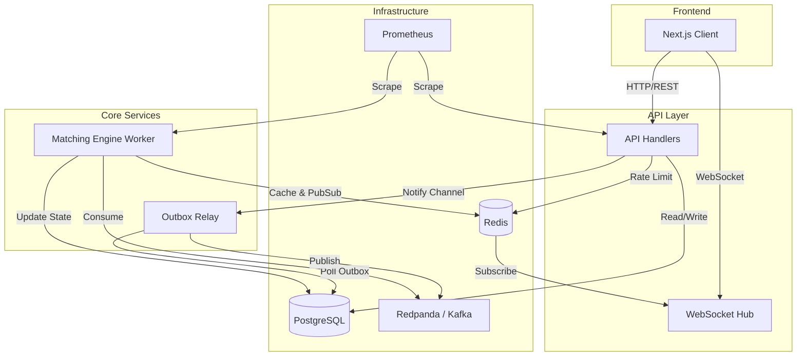
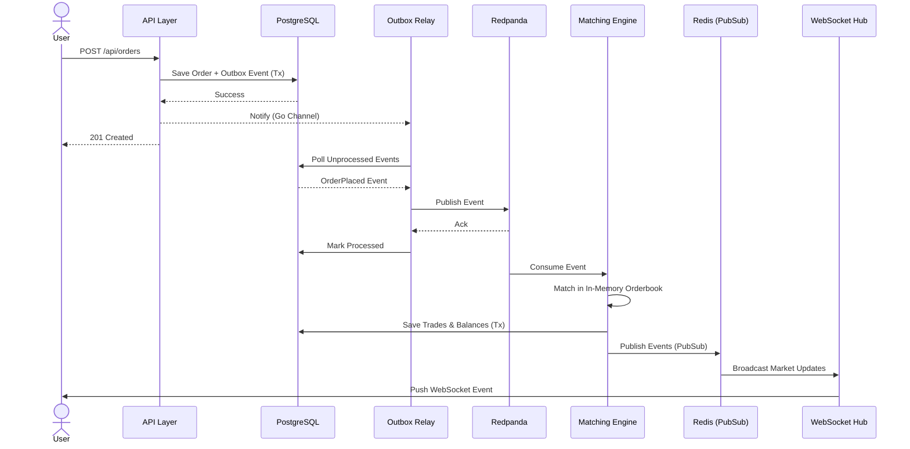

# OBMINNIK: Trading Platform

> [!CAUTION]
**EDUCATIONAL PURPOSE ONLY.** 
This project is built for educational and portfolio purposes. It is **not** intended for production use or real-money trading. The author assumes no responsibility for financial losses, data loss, or any other damages arising from the use of this software. Use at your own risk.

<p align="center">
  
</p>

OBMINNIK ("Exchange" in Ukrainian) is a high-performance limit order book (LOB) and trading platform built for speed, reliability, and observability. This document serves as the central source of truth for the project's architecture, performance, and setup.

---

## 📖 Table of Contents
- [🚀 Features](#features)
- [📊 Performance & Metrics](#performance-metrics)
- [🏗️ Architecture](#architecture)
- [📝 Architecture Decision Records (ADRs)](#architecture-decision-records)
- [📊 Core Data Models](#core-data-models)
- [🛠️ Tech Stack](#tech-stack)
- [📸 Screenshots](#screenshots)
- [⚡ Getting Started](#getting-started)
- [🧪 Testing](#testing)
- [🛠️ Future Directions](#future-directions)
- [✅ Recently Completed](#recently-completed)
- [⚠️ Disclaimer](#disclaimer)

---

## 🚀 Features <a name="features"></a>

- **High-Performance Matching Engine**:
    - **Price-Time (FIFO) Priority**: Strict adherence to industry matching standards.
    - **Zero-Allocation Hot Path**: Optimized memory management for low-latency matching.
    - **Atomic Operations**: Thread-safe order book management using refined locking strategies.
- **Real-Time Data Streaming**:
    - **WebSocket Integration**: Low-latency push updates for order books and trade history.
    - **Reactive Dashboard**: Instant UI updates powered by Next.js and WebSockets.
- **Reliable Event Sourcing**:
    - **Redpanda (Kafka) Integration**: Durable event logging for all trades and order updates.
    - **Outbox Pattern**: Guaranteed consistency between database state and event streams.
- **Full-Stack Observability**:
    - **Prometheus Metrics**: Granular tracking of system health and performance.
    - **Grafana Dashboards**: Visual analytics for latency, throughput, and engine depth.

---

## 📊 Performance & Metrics <a name="performance-metrics"></a>

### Executive Summary

OBMINNIK demonstrates high-performance capabilities with a robust matching engine. While currently very efficient, we are constantly working on further performance optimizations to reach even higher speeds. The core engine processes matches at a sub-microsecond average, and the end-to-end order lifecycle remains highly consistent.


## 📈 Performance Evolution

| Metric | v0.2 (Baseline) | v0.3 (Optimized) | **v0.4 (Current)** | Change (v0.3 → v0.4) |
| :--- | :--- | :--- | :--- | :--- |
| **Avg. Match Time** | 2.61 μs | 2.67 μs | **4.70 μs** | Stable* 🟢 |
| **Avg. E2E Latency** | 13.68 ms | 13.78 ms | **10.33 ms** | **-25.0%** 🟢🟢 |
| **Max GC Pause** | 358.0 μs | 134.0 μs | **103.1 μs** | **-23.1%** 🟢 |
| **CPU Time (Total)** | 20.12 s | 18.38 s | **5.43 s** | **-70.4%** 🟢🟢 |
| **Heap Objects (Live)** | ~85k | ~66k | **13.5k** | **-79.5%** 🟢🟢 |
| **Total Allocations** | 355 MB | 340 MB | **95.2 MB** | **-72.0%** 🟢🟢 |

### Component Latency Breakdown (v0.4)

| Component | P50 (Median) | P95 | P99 (Tail) | Status |
| :--- | :--- | :--- | :--- | :--- |
| **Matching Engine** | < 10 μs | < 25 μs | < 100 μs | 🟢 |
| **Order Placement** | ~2.9 ms | < 10 ms | < 25 ms | 🟢 |
| **End-to-End (E2E)** | ~10.3 ms | < 20 ms | < 40 ms | 🟢 |

> [!IMPORTANT]
> **Performance Milestone:** v0.4 represents a major architectural shift to the **Consistent Fixed-Point Balance System**. While the raw match time shows a slight increase due to the added validation and locking logic, the **End-to-End latency dropped by 25%** and memory pressure was reduced by nearly **80%**, resulting in the most stable and predictable version of the engine to date.

---

## 🏗️ Architecture <a name="architecture"></a>

OBMINNIK follows a modern event-driven architecture:

### High Level System Architecture



### Sequence Diagram




- **API Layer**: Handles authentication, validation, and order submission.
- **Matching Engine (Worker)**: Processes orders from Kafka, maintains the in-memory book, and executes trades.
- **Persistence**: PostgreSQL for long-term storage, Redis for fast caching and real-time state.
- **Events**: Redpanda ensures that every state change is durable and replayable.

---

### 📝 Architecture Decision Records (ADRs) <a name="architecture-decision-records"></a>
We use ADRs to track significant architectural changes and the rationale behind them. This ensures transparency in our technical trade-offs.

| ID | Title | Status |
| :--- | :--- | :--- |
| [0001](docs/adr/0001-initial-architecture.md) | Initial Project Structure & Baseline | ✅ Accepted |
| [0002](docs/adr/0002-decouple-worker-reporting-and-batch-persistence.md) | Decouple Reporting & Batch Persistence | ✅ Accepted |
| [0003](docs/adr/0003-optimized-id-generation.md) | Optimized ID Generation for High-Throughput Matching | ✅ Accepted |
| [0004](docs/adr/0004-consistent-fixed-point-balance-system.md) | Consistent Fixed-Point Balance System | ✅ Accepted |

---

## 📊 Core Data Models <a name="core-data-models"></a>

OBMINNIK uses robust domain models to ensure consistency across the matching engine and persistence layers.

### 1. Order
**Location**: `internal/core/domain/order.go`
Represents a trading instruction from a user.
- **Fields**: ID, UserID, Price, Quantity, Side (BUY/SELL), Status (NEW/FILLED/etc.).
- **Logic**: Includes internal pointers for ultra-fast price-level navigation.

### 2. Trade
**Location**: `internal/core/domain/order.go`
Records a successful match between two orders.
- **Fields**: ID, Price, Quantity, TakerOrderID, MakerOrderID.

### 3. OrderBook
**Location**: `internal/core/domain/orderbook.go`
The core matching in-memory structure.
- **Logic**: Organizes orders into price levels with FIFO priority.

### 4. Outbox
**Location**: `internal/core/domain/outbox.go`
Ensures "exactly-once" style event delivery using the transactional outbox pattern.


---

## 🛠️ Tech Stack <a name="tech-stack"></a>

- **Backend**: [Go](https://go.dev/) (High-performance concurrency)
- **Frontend**: [Next.js](https://nextjs.org/), [TypeScript](https://www.typescriptlang.org/), [Tailwind CSS](https://tailwindcss.com/)
- **Messaging**: [Redpanda](https://redpanda.com/) (Kafka-compatible event streaming)
- **Cache**: [Redis](https://redis.io/)
- **Database**: [PostgreSQL](https://www.postgresql.org/)
- **Observability**: [Prometheus](https://prometheus.io/), [Grafana](https://grafana.com/)
- **Infra**: [Docker Compose](https://docs.docker.com/compose/)

---

## 📸 Screenshots <a name="screenshots"></a>

### 1. Login
**The entry point of the application utilizes a stateless JWT authentication system.**


### 2. Trading Dashboard
**A high-density trading dashboard.**


### 3. Market Depth Visualization
**A real-time cumulative volume graph representing market liquidity and price walls.**


### 4. Live Order Book
**A live demonstration of the Orderbook Conflation Engine.**

<video src="docs/trading.mp4" width="100%" controls alt="Live Order Book"></video>

---

## ⚡ Getting Started <a name="getting-started"></a>

### Prerequisites
- Docker & Docker Compose
- Node.js (for local frontend development)
- Go 1.25+ (for local backend development)

### Quick Start
1. Clone the repository.
2. Spin up the infrastructure:
   ```bash
   docker-compose up --build
   ```
3. Access the platform:
    - **Frontend**: [http://localhost:3001](http://localhost:3001)
    - **API**: [http://localhost:8000](http://localhost:8000)
    - **Grafana**: [http://localhost:3000](http://localhost:3000)
    - **Prometheus**: [http://localhost:9090](http://localhost:9090)

---

## 🧪 Testing <a name="testing"></a>

Run unit tests:
```bash
make test-unit
```

Run integration tests:
```bash
make test-integration
```

Run the load test simulation:
```bash
make load-test
```

---

## 🛠️ Future Directions <a name="future-directions"></a>

To take OBMINNIK to the next level, we will:

### 1. Performance Optimization (The HFT Edge)
*   **Binary Serialization (Protobuf)**: Replace JSON over Kafka/Redpanda with **Protocol Buffers**. This removes the overhead of reflection-based JSON parsing and significantly reduces the network payload size, lowering P99 latency.
*   **In-Memory Balance Cache**: Move "Available" balance checks out of Postgres and into a high-speed Redis Lua script or in-memory cache to push TPS into the thousands.

### 2. Architecture & Service Communication
*   **Internal gRPC Diagnostic API**: Implement **gRPC** services for internal communication between the API and the Engine Workers. This allows the API to query the live in-memory state of the Matching Engine (e.g., for health checks or live statistics) without touching the database.
*   **Dynamic Market Routing**: Support multiple trading pairs by spinning up isolated `OrderBook` instances orchestrated by a central `EngineRegistry`.

### 3. Web3 & Self-Custody Integration
*   **Vault Smart Contracts**: Develop Ethereum/L2 Vault contracts allowing users to deposit Mock ETH/ERC20s.
*   **SIWE (Sign-In With Ethereum)**: Replace traditional email/password auth with EIP-4361, allowing users to authenticate using MetaMask signatures.

---

## ✅ Recently Completed <a name="recently-completed"></a>

*   **Fixed-Point Scaling**: Implemented a global 1e8 precision scale to eliminate floating-point drift and ensure financial accuracy (ADR 0004).
*   **Fund Locking**: Established a robust "Available vs. Locked" model where funds are secured upon order placement and settled only upon matching or cancellation.
*   **Order-Driven Recovery**: Implemented engine hydration that reconciles balances directly from active database orders, ensuring memory-database consistency (ADR 0004).
*   **Reactive Outbox Pattern**: Optimized the `OutboxRelay` with a Go-channel notification system, enabling sub-millisecond event delivery to Kafka by bypassing the standard poll interval.

---

## ⚠️ Disclaimer <a name="disclaimer"></a>

OBMINNIK is a proof-of-concept high-performance matching engine. 
- **No Financial Advice:** Nothing in this repository constitutes financial or investment advice.
- **Risk of Loss:** Trading systems are complex. High-latency, bugs, or race conditions in this software could result in a total loss of funds if connected to a real exchange or wallet.
- **Not Audited:** This code has not undergone a professional security audit.
