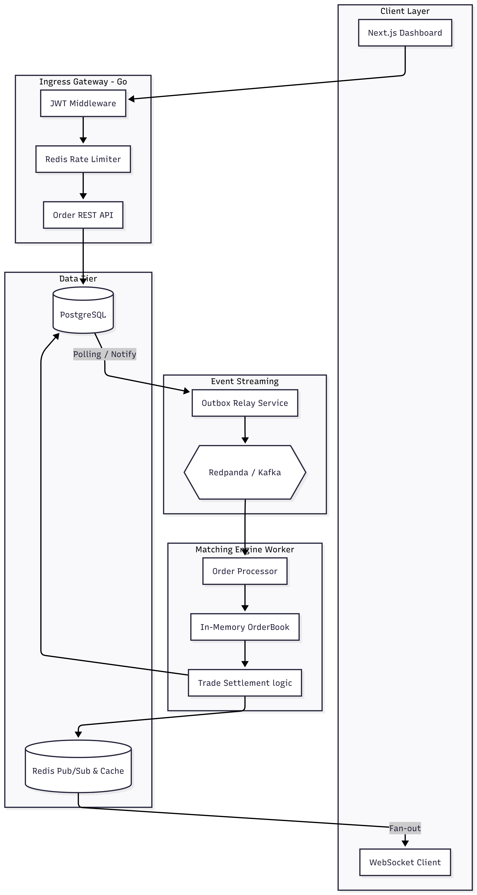
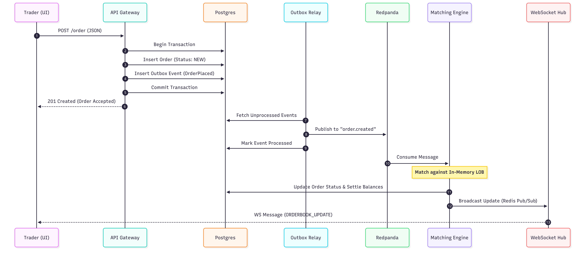
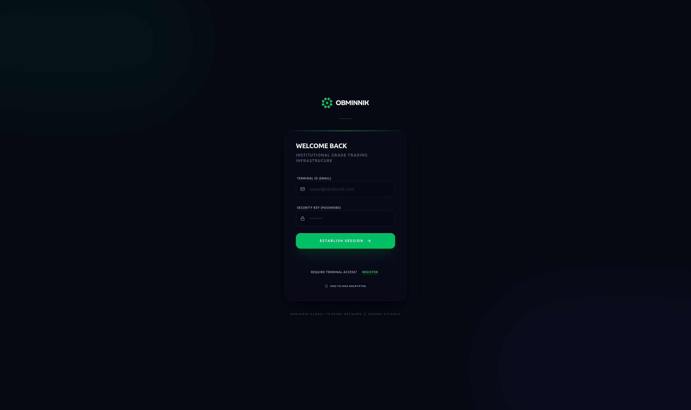
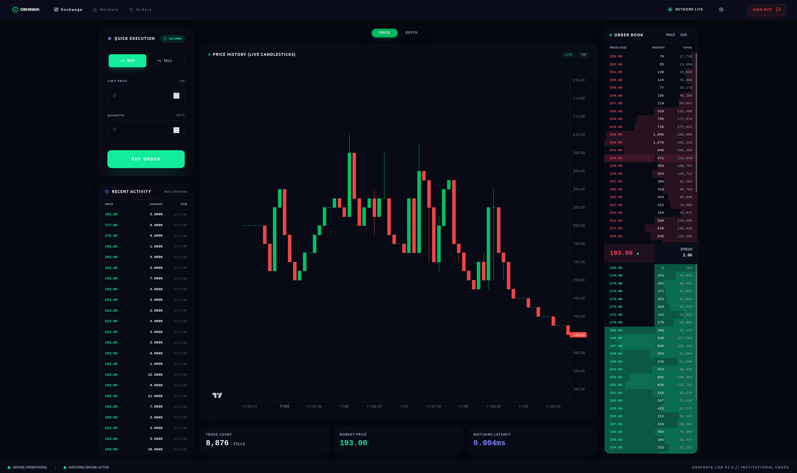
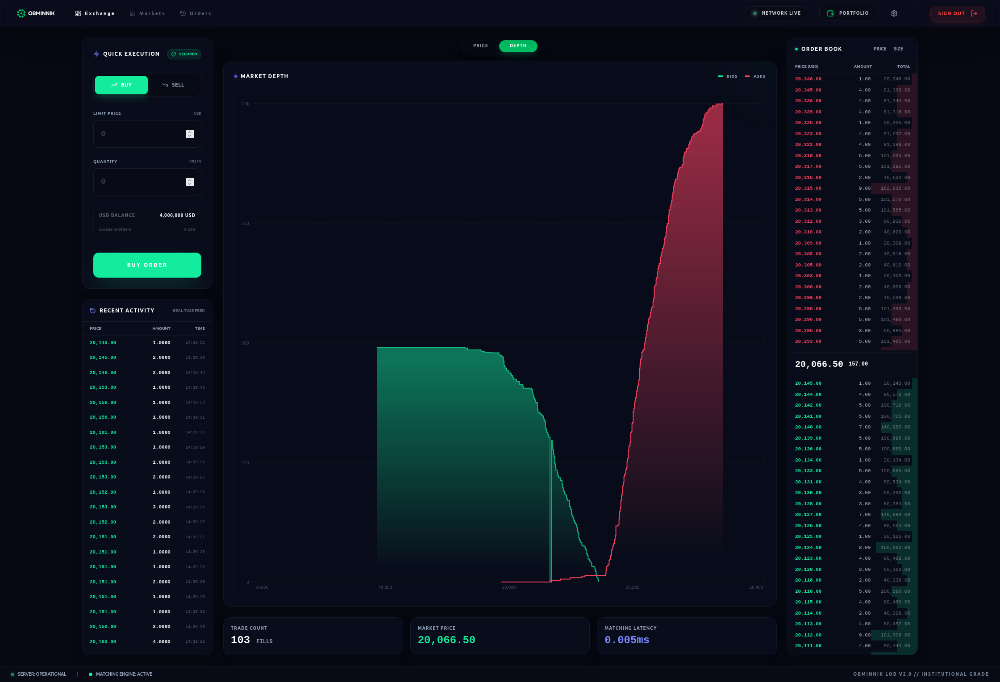

# OBMINNIK: Trading Platform

> [!CAUTION]
**EDUCATIONAL PURPOSE ONLY.** 
This project is built for educational and portfolio purposes. It is **not** intended for production use or real-money trading. The author assumes no responsibility for financial losses, data loss, or any other damages arising from the use of this software. Use at your own risk.

<p align="center">
  
</p>

OBMINNIK ("Exchange" in Ukrainian) is a high-performance limit order book (LOB) and trading platform built for speed, reliability, and observability. This document serves as the central source of truth for the project's architecture, performance, and setup.

---

## 📖 Table of Contents
- [🚀 Features](#features)
- [📊 Performance & Metrics](#performance--metrics)
    - [Executive Summary](#executive-summary)
    - [Latency Analysis](#latency-analysis)
    - [Resource Utilization](#resource-utilization)
- [🏗️ Architecture](#architecture)
- [📊 Core Data Models](#core-data-models)
- [🛠️ Tech Stack](#tech-stack)
- [📸 Screenshots](#screenshots)
- [⚡ Getting Started](#getting-started)
- [🧪 Testing](#testing)
- [🛠️ Future Directions](#future-directions)
- [⚠️ Disclaimer](#disclaimer)

---

## 🚀 Features <a name="features"></a>

- **High-Performance Matching Engine**:
    - **Price-Time (FIFO) Priority**: Strict adherence to industry matching standards.
    - **Zero-Allocation Hot Path**: Optimized memory management for low-latency matching.
    - **Atomic Operations**: Thread-safe order book management using refined locking strategies.
- **Real-Time Data Streaming**:
    - **WebSocket Integration**: Low-latency push updates for order books and trade history.
    - **Reactive Dashboard**: Instant UI updates powered by Next.js and WebSockets.
- **Reliable Event Sourcing**:
    - **Redpanda (Kafka) Integration**: Durable event logging for all trades and order updates.
    - **Outbox Pattern**: Guaranteed consistency between database state and event streams.
- **Full-Stack Observability**:
    - **Prometheus Metrics**: Granular tracking of system health and performance.
    - **Grafana Dashboards**: Visual analytics for latency, throughput, and engine depth.

---

## 📊 Performance & Metrics <a name="performance--metrics"></a>

### Executive Summary

OBMINNIK demonstrates high-performance capabilities with a robust matching engine. While currently very efficient, we are constantly working on further performance optimizations to reach even higher speeds. The core engine processes matches at a sub-microsecond average, and the end-to-end order lifecycle remains highly consistent.


## 📈 Performance Benchmarks

| Metric | v0.1 (Baseline) | **v0.2 (Optimized)** | Change |
| :--- | :--- | :--- | :--- |
| **Test Methodology** | Sequential (Low Pressure) | **Concurrent (High Pressure)** | |
| **Total Orders** | 2,027 | **13,690** | **+575%** 🟢 |
| **Total Trades** | 2,150 | **10,973** | **+410%** 🟢 |
| **Avg. Match Time** | 3.98 μs | **2.61 μs** | **-34%** 🟢 |
| **Avg. E2E Latency** | 12.24 ms | **13.68 ms** | +1.4 ms 🟡 |
| **Placement Latency (P99)**| < 25 ms | **< 10 ms** | **-60%** 🟢 |
| **Max GC Pause** | 562 μs | **358 μs** | **-36%** 🟢 |
| **Heap Usage (In-Use)** | 4.04 MB | **8.06 MB** | Stable 🟢 |

### Component Latency Breakdown (v0.2)

| Component | P50 (Median) | P95 | P99 (Tail) | Status |
| :--- | :--- | :--- | :--- | :--- |
| **Matching Engine** | < 1 ms | < 1 ms | < 1 ms | 🟢 |
| **Order Placement** | < 5 ms | < 10 ms | < 10 ms | 🟢 |
| **End-to-End (E2E)** | ~12 ms | < 25 ms | < 50 ms | 🟢 |

> [!IMPORTANT]
> **Methodology Shift:** v0.1 was tested using serial scripts with minimal concurrency. **v0.2 was tested using a concurrent multi-threaded load balancer** simulating 20+ traders hitting the API simultaneously with high-frequency updates. Despite the significantly higher stress, v0.2 achieves a **34% faster matching speed** and maintains stable performance under heavy "thundering herd" conditions.

---

## 🏗️ Architecture <a name="architecture"></a>

OBMINNIK follows a modern event-driven architecture:

### High Level System Architecture


### Sequence Diagram



- **API Layer**: Handles authentication, validation, and order submission.
- **Matching Engine (Worker)**: Processes orders from Kafka, maintains the in-memory book, and executes trades.
- **Persistence**: PostgreSQL for long-term storage, Redis for fast caching and real-time state.
- **Events**: Redpanda ensures that every state change is durable and replayable.

---

### 📝 Architecture Decision Records (ADRs)
We use ADRs to track significant architectural changes and the rationale behind them. This ensures transparency in our technical trade-offs.

| ID | Title | Status |
| :--- | :--- | :--- |
| [0001](docs/adr/0001-initial-architecture.md) | Initial Project Structure & Baseline | ✅ Accepted |
| [0002](docs/adr/0002-decouple-worker-reporting-and-batch-persistence.md) | Decouple Reporting & Batch Persistence | ✅ Accepted |

---

## 📊 Core Data Models <a name="core-data-models"></a>

OBMINNIK uses robust domain models to ensure consistency across the matching engine and persistence layers.

### 1. Order
**Location**: `internal/core/domain/order.go`
Represents a trading instruction from a user.
- **Fields**: ID, UserID, Price, Quantity, Side (BUY/SELL), Status (NEW/FILLED/etc.).
- **Logic**: Includes internal pointers for ultra-fast price-level navigation.

### 2. Trade
**Location**: `internal/core/domain/order.go`
Records a successful match between two orders.
- **Fields**: ID, Price, Quantity, TakerOrderID, MakerOrderID.

### 3. OrderBook
**Location**: `internal/core/domain/orderbook.go`
The core matching in-memory structure.
- **Logic**: Organizes orders into price levels with FIFO priority.

### 4. Outbox
**Location**: `internal/core/domain/outbox.go`
Ensures "exactly-once" style event delivery using the transactional outbox pattern.


---

## 🛠️ Tech Stack <a name="tech-stack"></a>

- **Backend**: [Go](https://go.dev/) (High-performance concurrency)
- **Frontend**: [Next.js](https://nextjs.org/), [TypeScript](https://www.typescriptlang.org/), [Tailwind CSS](https://tailwindcss.com/)
- **Messaging**: [Redpanda](https://redpanda.com/) (Kafka-compatible event streaming)
- **Cache**: [Redis](https://redis.io/)
- **Database**: [PostgreSQL](https://www.postgresql.org/)
- **Observability**: [Prometheus](https://prometheus.io/), [Grafana](https://grafana.com/)
- **Infra**: [Docker Compose](https://docs.docker.com/compose/)

---

## 📸 Screenshots <a name="screenshots"></a>

### 1. Login
**The entry point of the application utilizes a stateless JWT authentication system.**




### 2. Trading Dashboard
**A high-density trading dashboard.**



### 3. Market Depth Visualization
**A real-time cumulative volume graph representing market liquidity and price walls.**


### 4. Live Order Book
**A live demonstration of the Orderbook Conflation Engine.**


---

## ⚡ Getting Started <a name="getting-started"></a>

### Prerequisites
- Docker & Docker Compose
- Node.js (for local frontend development)
- Go 1.25+ (for local backend development)

### Quick Start
1. Clone the repository.
2. Spin up the infrastructure:
   ```bash
   docker-compose up --build
   ```
3. Access the platform:
    - **Frontend**: [http://localhost:3001](http://localhost:3001)
    - **API**: [http://localhost:8000](http://localhost:8000)
    - **Grafana**: [http://localhost:3000](http://localhost:3000)
    - **Prometheus**: [http://localhost:9090](http://localhost:9090)

---

## 🧪 Testing <a name="testing"></a>

Run integration tests:
```bash
go test -v ./cmd/api/...
```

Run matching engine unit tests:
```bash
go test -v ./internal/core/domain/...
```

Run the load test simulation:
```bash
cd load_test
python load_test.py
```

---

## 🛠️ Future Directions <a name="future-directions"></a>

To take OBMINNIK to the next level, we will:

### 1. Architecture Design Records (ADR)
- [x] Adapt **ADRs** to document key architectural decisions and their rationale. As the system grows in complexity (e.g., adding multi-asset support or self-custody), we need a clear audit trail of *why* specific trade-offs were made. This ensures long-term maintainability and helps new contributors understand the "reasoning" behind the code.

### 2. Robust Ledger & Balance Management

- Double-Entry Accounting: Transition from simple balance updates to a strict double-entry ledger. Every movement of funds must have a corresponding ledger_entry (Audit Trail) to ensure the system is mathematically provable and auditable.
- "Available vs. Locked" Model: Implement logic to move funds to a LOCKED state when an order is placed and only SETTLE (move to the counterparty) or UNLOCK (on cancel) once the matching engine confirms the event.
- Atomic Settlement: Ensure that a trade settlement (updating Buyer, Seller, and Fee accounts) happens within a single database transaction to prevent "partial fills" where one side gets the money but the other doesn't.

### 3. Multi-Asset & Market Support
- Dynamic Market Routing: Support multiple trading pairs (e.g., BTC/USD, ETH/USD) by spinning up isolated OrderBook instances for each pair, orchestrated by a central EngineRegistry.
- Fixed-Point Arithmetic: Move away from any potential float usage in the pipeline. Implement a standardized Decimal handling system (e.g., storing all values as int64 with a base-18 precision) to handle assets like ETH without precision loss.
- Fee Engine: Implement a tiered fee structure (Maker/Taker) that calculates and deducts commissions in real-time during the matching process.

### 4. Web3 & Self-Custody Integration
- Vault Smart Contracts: Develop an Ethereum/L2 Vault contract that allows users to deposit Mock ETH/ERC20s.
- Blockchain Event Listener: Build a high-reliability Go service using go-ethereum to watch for Deposit events and automatically credit user balances in the off-chain engine.
- SIWE (Sign-In With Ethereum): Replace traditional email/password auth with EIP-4361, allowing users to authenticate using MetaMask signatures, making the system "Crypto-Native."

### 5. Advanced Observability & SRE (Site Reliability Engineering)
- Latency SLOs (Service Level Objectives): Define and alert on "Latency Budgets." If P99 E2E latency exceeds 100ms for more than 1 minute, trigger automated PagerDuty/Slack notifications.
- Consumer Lag Monitoring: Track the delta between the Kafka "High Watermark" (last produced order) and the Worker's current offset. If the gap grows, the system is underperforming and needs to auto-scale.
- Tracing with OpenTelemetry: Implement distributed tracing to visualize the life of a single Order ID as it hops from the API, through Kafka, into the Worker, and finally to the WebSocket.

### 6. Performance Optimization (The HFT Edge)
- Hot-Path Zero Allocation: Refactor the matching engine loop to use sync.Pool for Trade and Order objects, reducing GC pressure and eliminating the latency "jitter" currently seen in your P99 metrics.
- In-Memory Balance Cache: Move the "Available" balance check out of Postgres and into a high-speed in-memory cache (or Redis Lua scripts) to push TPS (Transactions Per Second) from the current double-digits into the thousands.
- Binary Serialization: Replace JSON over Kafka/WebSockets with Protocol Buffers (Protobuf) or SBE (Simple Binary Encoding) to reduce payload size and CPU cycles spent on (un)marshalling.

### 7. Reliability & Determinism
- Event Sourcing & Replay: Ensure the Matching Engine is 100% deterministic. If the Worker crashes, it should be able to "replay" the Kafka topic from the last snapshot to perfectly rebuild the OrderBook state without data loss.
- Graceful Degradation: Implement "Circuit Breakers" that automatically stop order acceptance if the Database or Kafka becomes unreachable, protecting the system from entering an inconsistent state.

## ⚠️ Disclaimer <a name="disclaimer"></a>

OBMINNIK is a proof-of-concept high-performance matching engine. 
- **No Financial Advice:** Nothing in this repository constitutes financial or investment advice.
- **Risk of Loss:** Trading systems are complex. High-latency, bugs, or race conditions in this software could result in a total loss of funds if connected to a real exchange or wallet.
- **Not Audited:** This code has not undergone a professional security audit.
